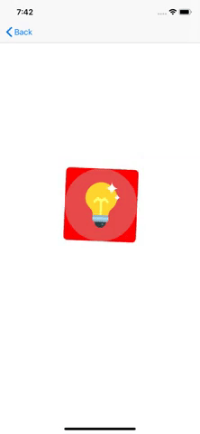
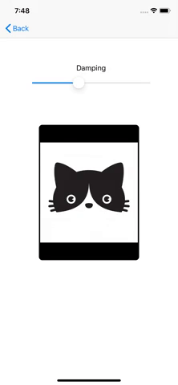
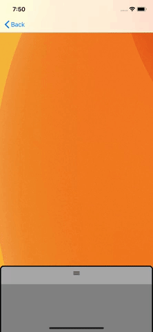

## Various Animation Demos with UIKit & Swift

### Jittery Icons

Mimics the icon jitter when deleting icons from an iOS home screen.

### Snap to Center

Using UIKit Dynamics, the card will be snapped back to center after being moved around with pan gestures.

### Bouncy Card

Creating a card that uses reversed gravity & collision to open up and basic animations to close. Additional background blurring during each sequence also included.

